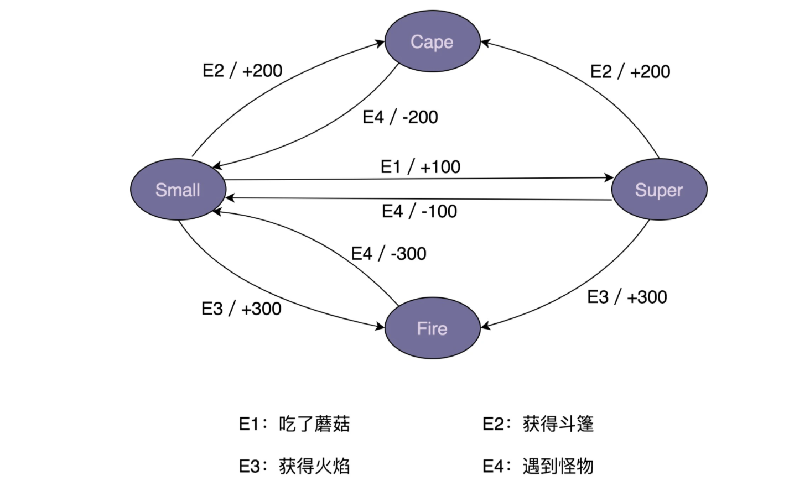

## 观察者模式

观察者模式也被称为发布订阅模式，即： 在对象之间定义一个一对多的依赖，当一个对象状态改变的时候，所有依赖的对象都会总动通知。

[Demo](observable/Demo.java)

上述demo采用的是同步阻塞的实现方式,Observer和Subject的代码在同一个线程里执行,Subject只有for循环的update执行完之后才能执行后面的逻辑.

,如果Subject改动频繁,对性能比较敏感,希望notifyUpdate接口相应时间尽可能短,就需要采用异步非阻塞方式实现了

如何实现一个异步非阻塞的观察者模式呢?

简单的做法就是每个update使用一个新的线程去完成.而更优雅的实现方式就是借用Google Guava EventBus框架的设计思路了.

### 实现一个异步非阻塞的EventBus框架

[Subscribe](observable/eventbus/Subscribe.java) 是一个注解,用于标明观察者中的哪个函数用来接受消息.

[ObserverAction](observable/eventbus/ObserverAction.java) 类表示被注解的方法,其中target是观察者类,
method表示方法,主要用在ObserverRegistry的注册表记录信息.
  
[ObserverRegistry](observable/eventbus/ObserverRegistry.java)就是注册表,用来记录观察者类跟接受的postObject消息的映射.

[EventBus](observable/eventbus/EventBus.java)实现了阻塞同步的观察者模式;

[AsyncEventBus](observable/eventbus/AsyncEventBus.java) 其实就是EventBus的线程池模式实现

## 模板模式

模板模式又叫模板方法模式,具体说就是定义一个抽象类,指定方法调用骨架,将具体步骤推迟到子类中实现.这里的骨架,就是模板方法
JDK 中的 InputStream 和 Servlet,Junit中均用到了模板模式.

[Demo](template/Template.java)

## 策略模式

包含一个策略接口和一组实现这个这个接口的策略类。客户端基于接口编程，可以灵活替换不同的策略。

还有一个作用就是用策略类工厂封装创建逻辑，屏蔽创建细节。
[Demo](strategy/StrategyFactory.java)

## 职责链模式

职责链模式的定义就是 "将请求的发送和接收解耦,让多个接收对象都有机会处理这个请求.将这些接收对象串成一条链,并沿着这个链传递请求,直到某个接收对象能够处理它为止."

## 状态模式

状态模式不是很常用,常用于游戏,工作流引擎系统开发中.

例子: 马里奥的状态转化


分支逻辑法: [Demo](state/caseif/MarioMachine.java)

状态模式:[Demo](state/designed/MarioMachine.java)


## 迭代器模式
迭代器模式,又叫游标模式,用来遍历集合(容器)对象,迭代器模式就是将集合对象的遍历从集合对象中拆分出来,让其职责更加单一.

虽然平时开发中不需要重复造轮子,但是了解迭代器模式的实现原理,更加有利于看懂框架源码.

通常情况下迭代器有两种实现方式:

```java
// 实现方式一
public interface Iterator<E> {
    boolean hasNext();
    void next();
    E currentItem();
}
```
用next方法让游标往后移动一个元素,currentItem()用来获取游标所在位置的元素.

```java
//实现方式二
public interface Iterator<E>{
    boolean hasNext();
    E next();
}
```
移动游标和返回当前位置元素在同一个方法next()内完成.

第一种方式比第二种方式更加灵活,因为我们可以多次调用currentItem()多次获取当前位置元素,而不移动游标.

[Demo](iter/ArrayIterator.java)